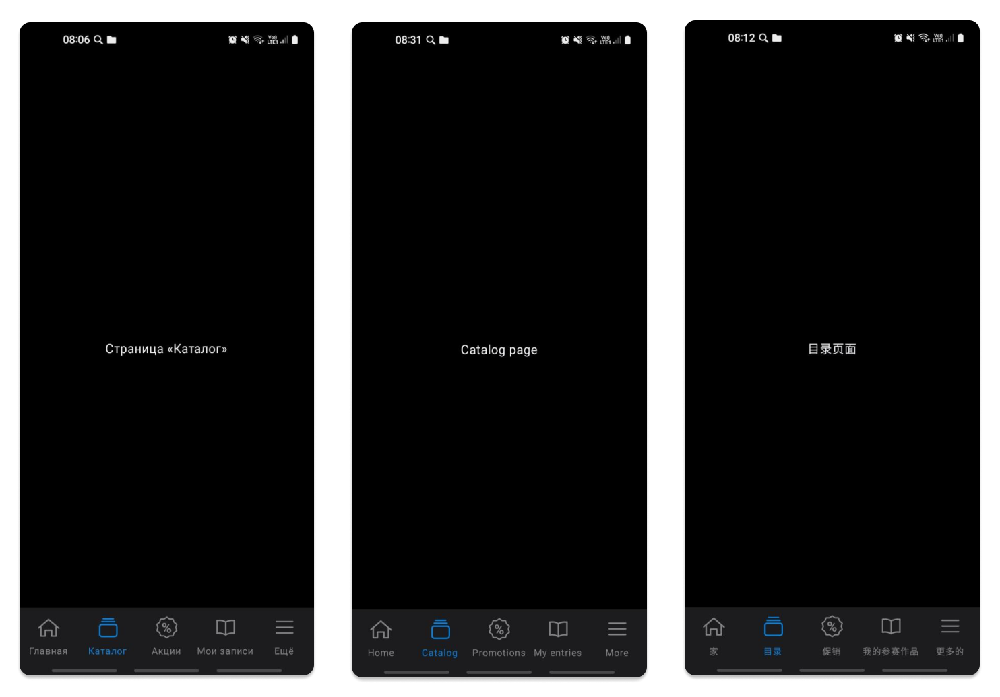

# Многомодульное приложение на Jetpack Compose

## Пример клиентского приложения сервиса DIKIDI API

## Описание приложения для сервиса онлайн записи клиентов
Это приложение предназначено для сервиса онлайн записи клиентов, предоставляя пользователям простой и интуитивно понятный интерфейс.
Оно демонстрирует возможности использования декларативного подхода в создании пользовательского интерфейса с помощью Jetpack Compose.
Приложение поддерживает адаптивные темы (светлую и темную), а также мультиязычность.

## Используемые технологии
- **Язык программирования**: Kotlin
- **Архитектура**: Multi-module clean architecture, Single Activity
- **Сетевые технологии**: REST, Coroutines
- **Настройки**: SharedPreferences,  механизмы шифрования с использованием `androidx.security:security-crypto`
- **Библиотеки**:
  - Jetpack Compose (создание интерфейса и навигации)
  - Material Desigh 3 (современый стиль UI)
  - Koin (внедрение зависимостей)
  - Coil (для загрузки изображений в Jetpack Compose)
  - Gson (работа с JSON)
  - LiveData (управление жизненным циклом данных)
  - Retrofit (сетевые запросы)
  - Android Jetpack (упрощение разработки)
  - Detekt (статический анализ кода)

## Архитектура приложения

## Скриншоты приложения:

### Главный экран

### Пример экрана в разработке

## Дополнительная информация
Данное приложение является многомодульным, с адаптивной темой (светлой/тёмной), мультиязычным интерфейсом,
поддержкой локации и алгоритмом расчёта навигационных расстояний.

Приложение выполнено в обазовательных целях как пример тестового задания
